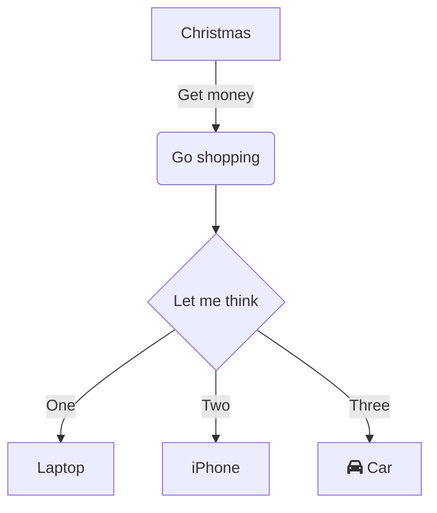

<div align="center"></div>

<br/>

`📄 .github/workflows/jekyll-gh-pages.yml`


<br/>


<!-- NOTE-swimm-snippet: the lines below link your snippet to Swimm -->
### 📄 package.json
```json
⬜ 7          "node": "9.7.1",
⬜ 8          "npm": "6.4.1"
⬜ 9        },
🟩 10       "scripts": {
🟩 11         "start": "node index.js",
🟩 12         "backend": "nodemon index.js",
🟩 13         "frontend": "npm run start --prefix client",
🟩 14         "dev": "concurrently \"npm run backend\"  \"npm run start --prefix client\"",
🟩 15         "heroku-postbuild": "NPM_CONFIG_PRODUCTION=false npm install --prefix client && npm run build --prefix client"
⬜ 16       },
⬜ 17       "author": "",
⬜ 18       "license": "ISC",
```

<br/>

[/snippet](snippet.0i797.sw.md)


[[sym-mention:(f22d1c29-65b6-40dc-9bfc-8b3e51ab4018|a58VC)rafal ski]]


<br/>

|1     |2     |\-  |
|------|------|----|
|qwerty|ytrewq|<br>|

<br/>

<!--MERMAID {width:100}-->


<br/>

# .heading1

## .heading2

### .heading3

*   1
    
*   2
    
*   3
    
    /
    

1.  test
    
2.  test2
    


```
let imHere = 10;
```

<br/>

[<--VIDEO-->](https://www.youtube.com/watch?v=WZY_in9oAjA)

<br/>

/

<br/>

This file was generated by Swimm. [Click here to view it in the app](https://app.swimm.io/repos/Z2l0aHViJTNBJTNBQ2hhdGJvdC1mb3ItV2Vic2l0ZS13aXRoLVJlYWN0JTNBJTNBY2hhdGJvdC1ob3N0ZWw0dS1wbA==/docs/65awp).